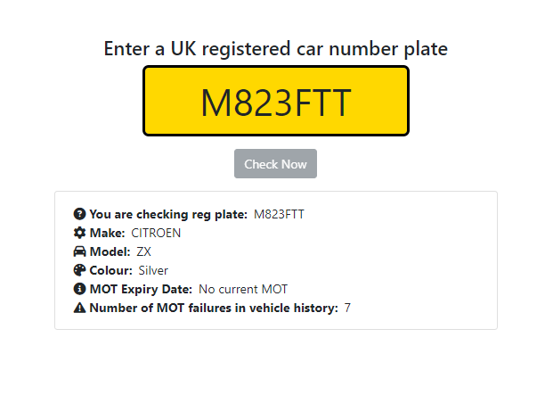

# Check An MOT

A simple .Net Core web app to check a UK registered car's MOT information using the DVLA's API.

Add a valid API Key to the appsettings.json to authenticate with the API.

Works for cars with past and present forms of reg plate whether currently on or off the road.

C#, .net 8, Selenium

